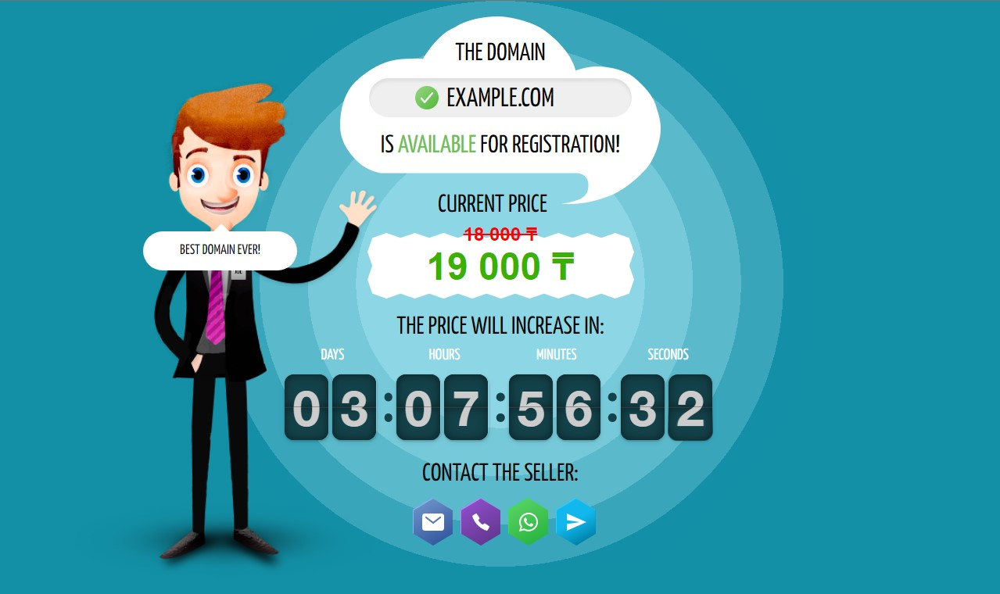

# Domain for Sale Landing

<div style="text-align:center">
  
</div>

This repository contains the source code and files for a simple landing page to promote the sale of a domain.

## Table of Contents

- [Getting Started](#getting-started)
- [Configuration](#configuration)
  - [Default fields](#default-fields)
  - [Domain fields](#domain-fields)
- [Adding new language](#adding-new-language)
- [Contributing](#contributing)
- [License](#license)

## Getting Started

To get started, simply clone or download this repository to your local machine:

```bash
git clone https://github.com/sa2kasov/domain-for-sale-landing.git
```

Install with NPM or Yarn.

```bash
npm install
# ...or...
yarn install
```

Once you have the code, you can modify the files to customize the landing page for your own domain.

## Configuration

Provide your domain data in the `./src/config.js`. Example of `config.js` file.

```javascript
export const config = {
  // Default data
  currency: '₸',
  language: 'en',
  email: 'seller@domain.com',
  phone: '+10123456789',
  whatsapp: '+11234567890',
  telegram: '@username',
  domains: [
    {
      name: 'example1.com',
      expiration: '2024-04-24T18:55:00+06:00',
      price: 100000,
      increasePrice: 1000,
      phone: false,
      whatsapp: '+12345678901',
      telegram: '@username1',
      hints: [
        'hint 1',
        'hint 2',
        'hint ...',
        'hint 100'
      ]
    },
    {
      name: 'example2.net',
      expiration: '2024-04-25T00:00:00+06:00',
      price: 200000,
      increasePrice: 1500,
      email: 'another-seller@domain.com',
      language: 'ru'
    },
    {
      name: 'example3.org',
      expiration: '2024-04-26T12:00:00+06:00',
      price: 300000,
      increasePrice: 2000,
      whatsapp: false,
      telegram: '+12345678902',
      hints: [
        'hint 1',
        'hint 2'
      ]
    },
  ]
}
```

### Default fields

| Field    | Description              | Example             |
|----------|--------------------------|---------------------|
| currency | Currency sign            | '₸'                 |
| language | Language code            | 'ru'                |
| email    | Email address            | 'seller@domain.com' |
| phone    | Phone number             | '+10123456789'      |
| whatsapp | Phone number             | '+11234567890'      |
| telegram | username or phone number | '@username'         |

### Domain fields

| Field         | Description     | Example                     |
|---------------|-----------------|-----------------------------|
| name          | Domain name     | 'example.com'               |
| expiration    | Expiration date | '2024-04-24T18:55:00+06:00' |
| price         | Domain price    | 100000                      |
| increasePrice | Price increase  | 1000                        |
| hints         | Array of hints  | [`hint1`, `hint 2`, `...`]  |

**Plus all fields from the default field. Any field in the domain field overrides the default values.**

If you don't want to provide data for any field of contacts, set it to `false`.

```javascript
// ...
domains: [
  {
    name: 'example.biz',
    phone: false,
    // ...
  }
]
```

The phone item will be omitted from the contacts for the `example.biz' domain.

Once you have made the necessary changes, you can host the landing page on any web server of your choice.

## Adding new language

Create a new language json file in `./src/locales/`. Take an example of the fields to be translated from existing files in the directory, e.g. `en.json`.

## Contributing

If you would like to contribute to this project, feel free to submit a pull request. However, please note that this project is intended to be a simple, lightweight landing page, so major changes may not be accepted.

## License

This project is licensed under the MIT License. See the [](https://github.com/sa2kasov/domain-for-sale-landing/blob/master/LICENSE) file for details.